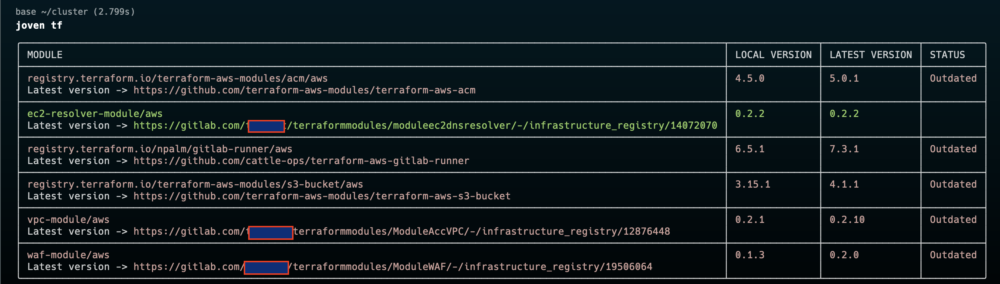
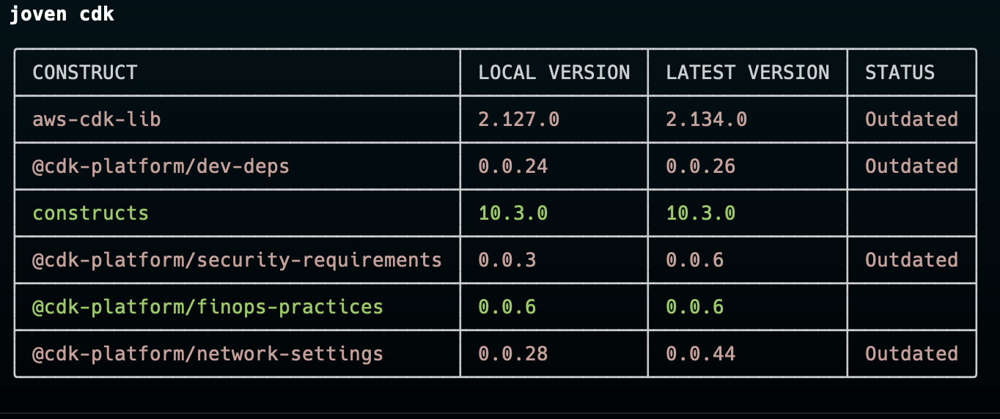

# Joven CLI Tool

Joven is a CLI tool designed for IaC dependency management. It helps to identify old Terraform modules and CDK constructs and libs in your IaC setup.
Currently we are supporting GitLab and Community Registry as a terraform modules storage.

## Installation

### MacOS via homebrew

```bash
brew tap netvolart/tap
brew install joven
```
### Linux and MacOS from binary

To install Joven, you can download the latest release from the [Releases](https://github.com/yourusername/joven/releases) page. Choose the binary that matches your operating system and architecture, download it, and place it in your system's PATH.

For example:

```sh
wget https://github.com/netvolart/joven/releases/download/v0.0.1/joven_0.0.1_linux_amd64.tar.gz
tar -xvzf joven_0.0.1_linux_amd64.tar.gz
chmod +x joven
sudo mv joven /usr/local/bin/
```

## Configuration

Joven uses a configuration file to store settings. 

You have to configure it first 

```bash
joven config set --token <gitlab private token>  --groups <gitlab group id>
```
Permisions required for a Token.

read_api, read_user, read_repository, read_registry

For a groups you can specify your parent to all moudules group id.

Joven saves configuration in `~/.joven-data.json`. New set command rewrites this file.

You can view the current configuration with the `get` command:

```bash
joven get
```

## Usage

### Terraform

To check terraform modules you have to:

- Naviage to a folder that contains your provider declaration.
- Run `terraform get` to download your modules for this state
- Run `joven tf` to get a repport about your modules.



### CDK
Joven can automatically detect CDK programming language in a synthesized CDK folder.

Supported languages:

- TypeScript
- C# (Work in progress)

#### TypeScript
To check CDK dependencies:

- Naviage to a folder that contains your CDK App.
- Synthesize your application `cdk synth`
- Run `joven cdk`
- Wait for result.

